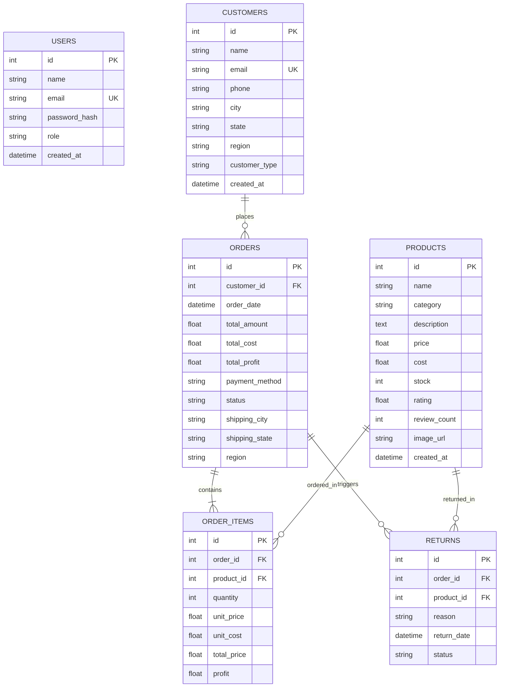

# 🛒 NyBasket – E-Commerce Sales & Customer Analytics Platform

> **Tagline:** *"Shop smarter. Understand customers. Grow better."*

NyBasket is a full-stack e-commerce analytics platform designed to simulate a real-world online retail business. The project combines an interactive shopping interface with a business intelligence dashboard for analyzing sales, customers, products, profitability, inventory, returns and regional performance.

Developed as a showcase portfolio project for a **3rd-year B.Tech Artificial Intelligence & Data Science** student demonstrating end-to-end full-stack software development, RESTful API engineering, and advanced business data analytics with Python & Pandas.

---

## 📌 Key Highlights

- **Complete E-Commerce Storefront**: 100+ realistic products across 6 categories (*Electronics, Fashion, Home & Kitchen, Beauty, Sports, Grocery*), multi-criteria filtering, price slider, real-time live search, product details, related products recommendations, shopping cart with localStorage persistence, and multi-step checkout simulation.
- **Executive Business Intelligence (BI) Dashboard**: Real-time KPI tracking for Total Gross Revenue, Net Profit, Orders, Customers, AOV, Gross Margin %, and Repeat Customer Rate.
- **Dynamic Chart.js Visualizations**: Monthly revenue & profit area charts, revenue by category doughnut charts, regional performance bar charts, and payment method distributions.
- **Automated Strategic Insights Engine (CEO & CMO)**: Dynamic algorithms directly querying SQL/Pandas to answer high-level executive questions (e.g. margin health, high-sales/low-profit anomalies, top-performing regions, at-risk customer winback recommendations).
- **RFM Customer Segmentation**: Behavioral cohort classification into *VIP Customers*, *Regular Customers*, *New Customers*, and *At Risk (>90 Days Inactive)*.
- **Inventory Valuation & Return Analytics**: Live inventory cost vs retail valuation, stock level warnings, replenishment indicators, return reasons breakdown, and category return rates.
- **Exported Analytical Dataset (`data/ecommerce_data.csv`)**: 520+ clean transactional records ready for Pandas, Excel, and Power BI.

---

## 🛠️ Technology Stack

| Layer | Technologies Used |
| :--- | :--- |
| **Frontend** | HTML5, CSS3 (Custom Design System + Dark Mode), Vanilla JavaScript (ES6+), Bootstrap 5 (CDN), FontAwesome 6 (CDN), Chart.js 4 (CDN) |
| **Backend** | Python 3, Flask, Flask-CORS, SQLAlchemy ORM, Werkzeug (Security/Hashing) |
| **Data Analytics** | Pandas, NumPy, SQLite Database (`nybasket.db`), Flat Analytical CSV (`ecommerce_data.csv`) |
| **Tools & Architecture** | REST API Architecture, Git, VS Code / Antigravity IDE |

---

## 🏗️ System Architecture & Database Schema



---

## 📂 Project Folder Structure

```
NyBasket/
├── backend/
│   ├── app.py                  # Main Flask application with all API endpoints & route handlers
│   ├── models.py               # SQLAlchemy ORM models (User, Product, Customer, Order, OrderItem, Return)
│   ├── database.py             # SQLite engine, session maker, init_db utilities
│   ├── seed_data.py            # Rich data generator (100+ products, 55+ customers, 280+ orders, CSV export)
│   ├── analytics.py            # Pandas & SQL analytics calculations (KPIs, Segments, Trends, CEO/CMO Insights)
│   └── auth.py                 # Password hashing (pbkdf2:sha256) & authentication helpers
├── frontend/
│   ├── css/
│   │   ├── style.css           # Global design system, CSS variables, dark mode, toast alerts, typography
│   │   ├── ecommerce.css       # Shopping layouts, catalog filters, product details, cart, checkout
│   │   └── dashboard.css       # Analytics layout, sidebar, KPI cards, charts, data tables
│   ├── js/
│   │   ├── api.js              # Centralized API fetch wrapper with toast notifications
│   │   ├── app.js              # Global navbar, dark mode toggle, cart badge counter, live search
│   │   ├── products.js         # Products catalog filtering, sorting, price slider, pagination
│   │   ├── product-details.js  # Product detail view, recommendations, stock status, add to basket
│   │   ├── cart.js             # Shopping cart calculation, quantity controls, coupon code, localStorage
│   │   ├── checkout.js         # Form validation, payment selector, order creation API, receipt modal
│   │   ├── auth.js             # Login/Register forms, demo credential quick-fill, user session
│   │   ├── dashboard.js        # KPI cards, Monthly Sales area chart, Category revenue doughnut, CEO/CMO Insights
│   │   ├── customers.js        # Customer analytics, customer segmentation, searchable table, rankings
│   │   └── analytics.js        # Deep-dive analytics suite (Sales, Products, Inventory, Returns)
│   ├── index.html              # Modern E-commerce Landing Page
│   ├── products.html           # Product Catalog & Filtering
│   ├── product-details.html    # Product Details & Recommendations
│   ├── cart.html               # Shopping Cart & Order Breakdown
│   ├── checkout.html           # Checkout & Simulated Payment
│   ├── login.html              # Authentication Login
│   ├── register.html           # Authentication Register
│   ├── dashboard.html          # Executive & Business Analytics Dashboard
│   ├── customers.html          # Customer Analytics & Segmentation
│   └── analytics.html          # Deep-Dive Sales, Product, Inventory & Return Analytics
├── data/
│   ├── nybasket.db             # SQLite database (auto-seeded)
│   └── ecommerce_data.csv      # Exported 520+ record dataset for Power BI/Excel/Pandas
├── .gitignore
├── requirements.txt            # Python dependencies (Flask, Flask-Cors, SQLAlchemy, pandas, werkzeug)
├── run.py                      # Root starter script to auto-initialize DB and start server
└── README.md                   # Comprehensive project documentation
```

---

## 🚀 Quick Start & Local Run Instructions

### 1. Prerequisites
- Python 3.9+ installed on your system.

### 2. Clone the Repository
```bash
git clone https://github.com/your-username/NyBasket.git
cd NyBasket
```

### 3. Create Virtual Environment & Install Dependencies
```bash
# Windows
python -m venv venv
venv\Scripts\activate

# macOS / Linux
python3 -m venv venv
source venv/bin/activate

# Install requirements
pip install -r requirements.txt
```

### 4. Run NyBasket with One Single Command
```bash
python run.py
```

Open your browser and navigate to:
👉 **`http://127.0.0.1:5000/`** or **`http://localhost:5000/`**

---

## 🔑 Demo Login Credentials

The application provides convenient quick-fill buttons on the login page:

| Role | Email | Password | Access Level |
| :--- | :--- | :--- | :--- |
| **Administrator** | `admin@nybasket.com` | `admin123` | Full Access to BI Analytics & Storefront |
| **Demo Customer** | `demo@nybasket.com` | `customer123` | Storefront Shopping & Order Tracking |

---

## 📡 REST API Reference

| Method | Endpoint | Description |
| :--- | :--- | :--- |
| `GET` | `/api/products` | Retrieve catalog products with filtering, search, rating, and sorting |
| `GET` | `/api/products/<id>` | Retrieve single product details with related category recommendations |
| `POST` | `/api/products` | Create a new product (Admin) |
| `GET` | `/api/customers` | Retrieve customer accounts with search & segment filters |
| `GET` | `/api/customers/<id>` | Retrieve customer profile and full order history |
| `GET` | `/api/orders` | List transactional orders |
| `POST` | `/api/orders` | Checkout endpoint: creates customer, places order, updates inventory |
| `GET` | `/api/analytics/summary` | Executive KPI cards (Revenue, Profit, Orders, AOV, Growth %) |
| `GET` | `/api/analytics/sales` | Monthly, weekly, daily revenue trends and payment methods |
| `GET` | `/api/analytics/categories` | Revenue, profit, units, and margin % per category |
| `GET` | `/api/analytics/products` | Top 10 best-sellers, top profitable, low-stock, and anomaly SKUs |
| `GET` | `/api/analytics/customers` | Customer RFM metrics, segment breakdown, and top spender lists |
| `GET` | `/api/analytics/returns` | Return & cancellation rates, reason distribution, category breakdown |
| `GET` | `/api/analytics/inventory` | Inventory valuation (Cost vs Retail) and stock replenishment monitor |
| `GET` | `/api/analytics/regions` | Regional Indian sales performance and city rankings |
| `GET` | `/api/analytics/insights` | Automated CEO & CMO strategic questions and answers |
| `POST` | `/api/auth/login` | Authenticate user with hashed password |
| `POST` | `/api/auth/register` | Register new user account |

---

## 💡 Skills Demonstrated

### 📊 Data Analyst & Business Intelligence Skills
- **Data Engineering**: Relational database modeling with SQLite and SQLAlchemy.
- **Exploratory Data Analysis (EDA)**: Aggregating 280+ orders and 520+ order items across 12 months with Pandas.
- **Financial KPI Development**: Accurate computation of Gross Revenue, Net Profit, Gross Margin %, Average Order Value (AOV), Return Rate %, and Repeat Customer Rate %.
- **Behavioral Customer Segmentation (RFM)**: Segmenting users into VIP, Regular, New, and At Risk cohorts based on transaction frequency, total spend, and inactivity recency.
- **Decision Intelligence**: Dynamic algorithmic rule-engine generating automated CEO & CMO strategic action plans.
- **Data Visualization**: Chart.js implementation for time-series trend analysis and categorical breakdowns.

### 💻 Full-Stack Software Engineering Skills
- **Python & Flask**: Clean modular REST API gateway with robust routing and error handling.
- **Database ORM**: Foreign keys, cascades, relationships, and parameterized queries avoiding SQL injection.
- **Secure Authentication**: Password hashing with PBKDF2/SHA-256 via Werkzeug.
- **Modern Vanilla Frontend**: Semantic HTML5, CSS custom properties, responsive Flexbox/Grid, and Vanilla ES6+ async/await client services.
- **State Management**: LocalStorage synchronization for persistent cart and dark/light mode preference.

---

## 📝 Resume Bullet Points (Copy & Paste Ready)

- **NyBasket – E-Commerce Sales & Customer Analytics Platform** *(Python, Flask, SQLite, Pandas, Vanilla JS, Chart.js)*
  - Designed and developed a full-stack e-commerce simulation platform managing 100+ products across 6 categories, 55+ customer accounts, and 280+ orders.
  - Engineered an automated Python/Pandas analytics pipeline computing key retail KPIs including ₹13.9L+ gross revenue, 53.8% net profit margin, and customer RFM segmentations.
  - Built interactive Chart.js dashboards providing monthly sales trends, inventory valuations, return rate anomalies, and dynamic CEO/CMO executive decision insights.
  - Implemented secure RESTful APIs with SQLAlchemy ORM, hashed user authentication, and persistent client-side state management.

---

## 🎤 Interview Explanation Guide

**Q: What was your motivation for building NyBasket?**
> *"In e-commerce, shopping websites and business analytics are often treated as separate worlds. I wanted to build an end-to-end platform that bridges the gap: a customer can browse, add items to their basket, and check out, while an executive can instantly inspect real-time revenue, profit margins, inventory valuation, and RFM customer segmentation derived from the underlying transactional database."*

**Q: How is the customer segmentation calculated?**
> *"The backend uses an RFM (Recency, Frequency, Monetary) approach in Python/Pandas. Customers who have spent over ₹25,000 or placed 6+ orders are classified as 'VIP Customers'. Customers with 2–5 orders are 'Regular Customers'. Customers with 1 order are 'New Customers'. Crucially, customers with past purchase history who have not transacted in over 90 days are flagged as 'At Risk', allowing automated win-back retention campaigns."*

---

## 🔮 Future Enhancements
- [ ] Integration of Machine Learning models for churn prediction and product recommendations using Scikit-Learn.
- [ ] Automated export to PDF Executive Summary Reports.
- [ ] Real-time WebSocket notifications for new order events.

---

## 👤 Author
- **AI & Data Science Student** (B.Tech 3rd Year)
- Portfolio Project: Full-Stack Web Development & Retail Data Analytics
